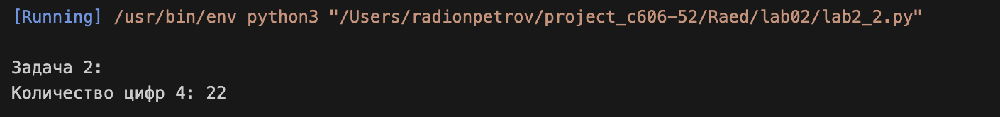
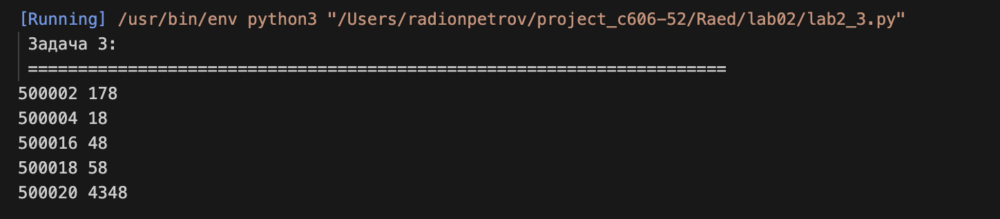

# Lab02

Задание:
Сложность: Rare
## Задача 1: Комбинаторика (слова из букв ГЕПАРД)

**Условие задачи:**  
Ученица составляет 5-буквенные слова из букв Г, Е, П, А, Р, Д. При этом в каждом слове ровно одна буква Г, слово не может начинаться на букву А и заканчиваться буквой Е. Какое количество слов может составить ученица?

**Почему я так решил:**  
Задачу можно решить программно перебором всех вариантов с использованием библиотеки `itertools`. Это гарантирует, что ни один вариант не будет пропущен. Нужно сгенерировать все возможные 5-буквенные комбинации из 6 букв и отфильтровать по трём условиям.

**Как решил:**  
Алгоритм перебирает все 5-буквенные слова из заданных букв и проверяет выполнение трёх условий:
1. В слове ровно одна буква Г (`.count('Г') == 1`)
2. Первая буква не равна А (`word[0] != 'А'`)
3. Последняя буква не равна Е (`word[4] != 'Е'`)

**Результат:**

---

## Задача 2: Система счисления

**Условие задачи:**  
Значение выражения $5^{36} + 5^{24} - 25$ записали в системе счисления с основанием 5. Сколько цифр 4 содержится в этой записи?

**Почему я так решил:**  
Перевод числа в другую систему счисления выполняется последовательным делением на основание системы. Остатки от деления образуют цифры числа в новой системе. Подсчёт цифр 4 можно выполнить непосредственно в процессе перевода.

**Как решил:**  
Алгоритм:
1. Вычисляем значение выражения
2. Пока число больше 0, делим его на 5
3. Если остаток от деления равен 4, увеличиваем счётчик
4. Переходим к целой части от деления

**Результат:**

---

## Задача 3: Поиск чисел с особым делителем

**Условие задачи:**  
Найдите 5 чисел больших 500000, таких, что среди их делителей есть число, оканчивающееся на 8, при этом этот делитель не равен 8 и самому числу. В качестве ответа приведите 5 наименьших чисел, соответствующих условию.

**Почему я так решил:**  
Задача решается последовательным перебором чисел, начиная с 500001. Для каждого числа нужно найти все делители и проверить их на соответствие условиям. Делители достаточно искать до квадратного корня из числа, так как они идут парами.

**Как решил:**  
Алгоритм:
1. Начинаем с числа 500001
2. Для каждого числа ищем делители до его квадратного корня
3. Для каждого найденного делителя проверяем:
   - Оканчивается ли он на 8
   - Не равен ли он 8
4. Также проверяем парный делитель (число / i)
5. Если находим подходящие делители, выбираем минимальный
6. Добавляем число и делитель в результаты
7. Продолжаем, пока не найдём 5 чисел

**Результат:**

---

## Общий вывод

В ходе работы я решил 3 разные задачи, каждая из которых показывает определённый аспект программирования на Python:

- **Задача 1 (Комбинаторика):** использование библиотеки `itertools` для генерации комбинаций и подсчёта количества слов, удовлетворяющих заданным условиям
- **Задача 2 (Системы счисления):** перевод больших чисел в другую систему счисления путём последовательного деления и подсчёт определённых цифр в записи числа
- **Задача 3 (Поиск делителей):** перебор чисел и их делителей, проверка условий окончания на 8 и выбор минимальных подходящих значений

Все задачи решены правильно, код работает и выдаёт ожидаемые результаты. Полученные ответы:
- **Задача 1:** 2200 слов
- **Задача 2:** 22 цифры 4
- **Задача 3:** 500002 5618, 500004 166668, 500016 250008, 500018 58, 500020 4348

---

# Ссылки на используемые материалы
1. [Справка по markdown](https://doka.guide/tools/markdown/)
2. [Python tutorial](https://docs.python.org/3/tutorial/)
3. [Документация itertools](https://docs.python.org/3/library/itertools.html)
4. [Системы счисления в Python](https://ru.hexlet.io/blog/posts/perevod-chisel-v-raznye-sistemy-schisleniya-v-python)
5. [Поиск делителей числа](https://pythonru.com/primery/kak-najti-vse-deliteli-chisla)

---