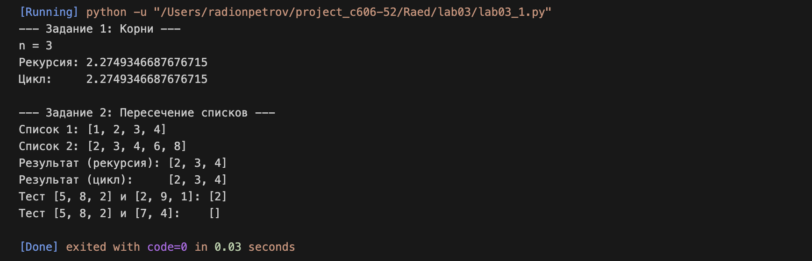

---

# Lab03

Задание:
Реализация алгоритмов для решения задач своего варианта двумя способами: с использованием рекурсии и без неё (итеративно).

---

## Задача 1: Расчёт вложенных корней $x_n$

Условие задачи:
Разработать функцию для вычисления значения выражения $x_n = \sqrt{3 + \sqrt{3 + \sqrt{3 + \dots + \sqrt{3}}}}$ при заданном количестве корней $n$.

Почему я так решил:
Структура выражения является самоподобной, что делает задачу классическим примером для применения рекурсии. Каждый следующий шаг вычисления включает в себя результат предыдущего. Итеративный подход выбран как более надежный, так как он исключает риск переполнения стека вызовов.

Как решил:
Алгоритм реализован следующим образом:

* Рекурсивный метод: Функция вызывает саму себя, уменьшая счетчик $n$ на единицу на каждом шаге. Точкой остановки (базовым случаем) является $n = 1$, когда возвращается просто корень из 3.
* Итеративный метод: Используется цикл for. Переменная-аккумулятор изначально равна нулю. На каждой итерации к ней прибавляется 3, после чего извлекается квадратный корень. Это позволяет вычислить выражение "изнутри наружу".

---

## Задача 2: Пересечение двух списков

Условие задачи:
Написать функцию intersect(lst1, lst2), которая находит общие элементы для двух списков и возвращает их в виде нового списка.

Почему я так решил:
Поиск пересечений — базовая операция обработки данных. Использование обычного цикла for позволяет сохранить порядок элементов первого списка, что соответствует примерам в задании. Рекурсия в данном случае демонстрирует навык работы с индексами и срезами списков.

Как решил:

* Рекурсивный метод: Проверяется первый элемент текущего списка. Если он содержится во втором списке, он включается в итоговый результат, который конкатенируется с результатом обработки оставшейся части списка.
* Итеративный метод: Создается пустой список. С помощью цикла выполняется проход по первому списку. Если текущий элемент присутствует во втором, он добавляется в результирующий список методом .append().

---

## Общий вывод

В ходе выполнения лабораторной работы №3 были освоены два подхода к написанию функций:

1. Рекурсия: Удобна для задач с четкой математической индукцией, делает код компактным, но требует осторожности с глубиной вложенности.
2. Итерация: Более эффективна с точки зрения использования памяти и скорости выполнения в языке Python, так как не создает дополнительные объекты в стеке вызовов.

Обе задачи были успешно решены обоими способами, результаты тестирования функций полностью совпали с контрольными примерами.

---

## Результат

---

## Ссылки на используемые материалы

1. [Справка по синтаксису Markdown](https://doka.guide/tools/markdown/)
2. [Рекурсивные функции в Python — официальная документация](https://docs.python.org/3/tutorial/controlflow.html)
3. [Методы работы со списками (list) в Python](https://docs.python.org/3/tutorial/datastructures.html)

---
