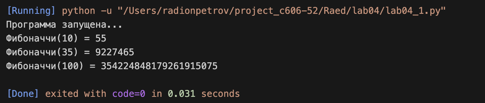

---

# Lab04

Задание:
Реализация функциональных возможностей Python: создание замыкания для генерации последовательности и разработка декоратора для оптимизации вычислений.

---

## Задача 1: Замыкание для последовательности Фибоначчи

Условие задачи:
Разработать замыкание, реализующее генерацию чисел последовательности Фибоначчи.

Почему я так решил:
Использование замыкания (closure) позволяет инкапсулировать логику вычислений внутри «фабричной» функции. Это обеспечивает сохранность состояния и защищает внутреннюю реализацию от внешнего вмешательства, предоставляя пользователю только готовый интерфейс для получения чисел.

Как решил:
Алгоритм реализован следующим образом:

* Внешняя функция (`fibonacci_factory`): выступает в роли контейнера, который возвращает внутреннюю функцию.
* Внутренняя функция (`fib`): реализует рекурсивный алгоритм вычисления $n$-го числа Фибоначчи по формуле $F_n = F_{n-1} + F_{n-2}$. Благодаря механизму замыкания, функция остается доступной даже после завершения работы внешней функции.

---

## Задача 2: Декоратор для кэширования

Условие задачи:
Написать декоратор, предназначенный для кэширования (мемоизации) результатов выполнения функций. Применить данный декоратор к замыканию Фибоначчи.

Почему я так решил:
Рекурсивное вычисление чисел Фибоначчи имеет экспоненциальную сложность $O(2^n)$, что приводит к резкому замедлению программы при росте $n$. Декоратор кэширования позволяет хранить уже вычисленные значения в словаре, сокращая сложность до линейной $O(n)$ и предотвращая избыточные вычисления.

Как решил:

* Механизм декоратора: Создается функция-обертка, которая содержит внутри себя словарь cache.
* Логика работы: Перед каждым вызовом функции декоратор проверяет, есть ли аргумент n в словаре. Если результат найден — он возвращается мгновенно. Если нет — функция выполняется, а результат записывается в кэш для последующего использования.
* Интеграция: Декоратор применен к внутренней функции замыкания с помощью синтаксиса @cache_decorator, что позволяет оптимизировать каждый рекурсивный шаг.

---

## Общий вывод

В ходе выполнения лабораторной работы №4 были освоены продвинутые техники программирования на Python:

1. Замыкания: Позволяют создавать гибкие функции с сохранением контекста и скрытой логикой.
2. Декораторы: Продемонстрировали свою эффективность как инструмент для расширения функционала (в данном случае — оптимизации скорости) без изменения основного кода алгоритма.

Комбинация этих подходов позволила превратить ресурсоемкую рекурсивную функцию в высокопроизводительный инструмент, способный мгновенно вычислять значения больших порядков.

---

---

## Ссылки на используемые материалы

1. [Замыкания в Python — основы и примеры](https://www.google.com/search?q=https://pythonru.com/osnovy/zamykanija-v-python)
2. [Декораторы функций в Python — официальный туториал](https://www.google.com/search?q=https://docs.python.org/3/glossary.html%23term-decorator)
3. [Мемоизация и оптимизация рекурсии](https://www.google.com/search?q=https://ru.wikipedia.org/wiki/%D0%9C%D0%B5%D0%BC%D0%BE%D0%B8%D0%B7%D0%B0%D1%86%D0%B8%D1%8F)

---
