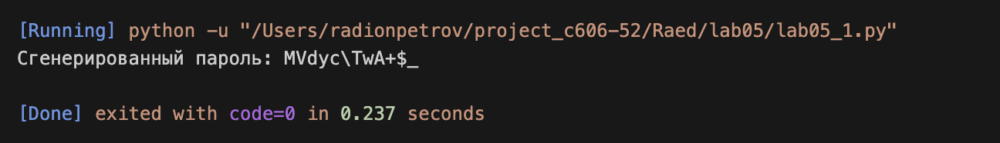

# Lab05

Задание:
Реализация генератора паролей с применением функций высшего порядка: `map`, `filter`, `reduce`.

---

## Задача: Генератор паролей с инверсией регистра

Условие задачи:
Написать генератор, создающий пароли по определённым правилам. Инвертировать регистр букв в выводе генератора. К генератору должна быть применена хотя бы одна из функций `map`, `filter`, `reduce`.

Почему я так решил:
Использование функции-генератора (`yield`) позволяет выдавать символы по одному, не создавая весь пароль сразу в памяти. Это эффективнее, чем формировать список. Функции `map`, `filter` и `reduce` из функционального стиля программирования позволяют обрабатывать поток символов в виде цепочки преобразований — каждая функция делает одно конкретное действие.

Как решил:

* **Генератор `password_generator`**: собирает набор допустимых символов (буквы, цифры, спецсимволы) и по одному выдаёт случайные символы через `yield`.
* **`map`**: применяет `.swapcase()` к каждому символу — инвертирует регистр (`'a'→'A'`, `'A'→'a'`, цифры не меняются).
* **`filter`**: убирает из потока символы-пробелы (защитный шаг, так как в `string.punctuation` пробел отсутствует, но проверка делает код надёжнее).
* **`reduce`**: склеивает все символы в одну итоговую строку — готовый пароль.

---

## Общий вывод

В ходе выполнения лабораторной работы №5 были освоены инструменты функционального программирования в Python:

1. **Генераторы**: Позволяют «лениво» производить данные по одному элементу, экономя память и делая код чище.
2. **`map`**: Применяет функцию к каждому элементу последовательности без явного цикла.
3. **`filter`**: Оставляет только те элементы, которые удовлетворяют условию.
4. **`reduce`**: Сворачивает последовательность в одно значение (в данном случае — строку).

Цепочка `map → filter → reduce` позволила построить лаконичный конвейер обработки символов без единого явного цикла `for`.

---

## Результат выполнения программы

---

## Ссылки на используемые материалы

1. [Генераторы в Python — документация](https://docs.python.org/3/glossary.html#term-generator)
2. [Функции map, filter, reduce — руководство](https://docs.python.org/3/library/functools.html#functools.reduce)
3. [Модуль string — наборы символов](https://docs.python.org/3/library/string.html)

---
