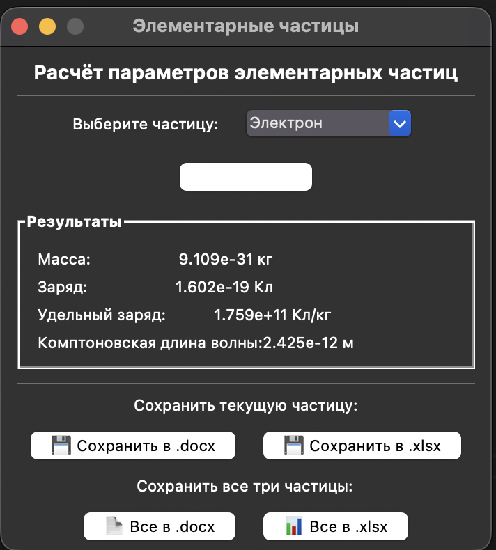

# Lab06

Задание:
Создать пакет, содержащий 3 модуля, и подключить его к основной программе с графическим интерфейсом. Программа выполняет расчёт удельного заряда и комптоновской длины волны для элементарных частиц (электрон, протон, нейтрон). Реализовать сохранение результатов в `.docx` и `.xlsx`.

---

## Задача 1: Пакет `particles`

Условие задачи:
Разработать Python-пакет из трёх модулей, реализующих хранение данных, расчётные формулы и сохранение отчётов.

Почему я так решил:
Разбивка на модули позволяет чётко разделить зоны ответственности: один файл хранит данные, второй — считает, третий — сохраняет. Это делает код читаемым и легко расширяемым. Пакет подключается к основной программе одной строкой через `__init__.py`.

Как решил:

* **`chasticy.py`** — содержит физические константы (`h`, `c`) и словарь `PARTICLES` с массой и зарядом каждой частицы.
* **`formuly.py`** — содержит две функции:
  - `udelny_zaryad(charge, mass)` — вычисляет удельный заряд по формуле $q/m$ (Кл/кг).
  - `kompton(mass)` — вычисляет комптоновскую длину волны по формуле $\lambda = h / (m \cdot c)$ (м).
* **`sohranenie.py`** — содержит функции `v_word` и `v_excel` для сохранения результатов в файлы с помощью библиотек `python-docx` и `openpyxl`.
* **`__init__.py`** — импортирует всё из трёх модулей, чтобы основная программа могла писать просто `from particles import ...`.

---

## Задача 2: GUI-программа

Условие задачи:
Реализовать графический интерфейс для ввода параметров и отображения результатов расчёта. Добавить возможность сохранения в `.docx` и `.xlsx`.

Почему я так решил:
Tkinter выбран как встроенный фреймворк Python — он не требует установки и прост в объяснении. Выпадающий список (`Combobox`) удобен для выбора одной из трёх частиц, а текстовые метки наглядно показывают результаты.

Как решил:

* Пользователь выбирает частицу из выпадающего списка и нажимает «Рассчитать».
* Функция `rasschitat()` берёт данные из пакета, вызывает формулы и обновляет метки в окне.
* Четыре кнопки сохранения позволяют сохранить либо текущую частицу, либо все три сразу — в Word или Excel.

---

## Общий вывод

В ходе выполнения лабораторной работы №6 были освоены:

1. **Пакеты Python**: Папка с `__init__.py` становится пакетом, который можно импортировать как модуль.
2. **Разделение кода по модулям**: Данные, логика и вывод разнесены по отдельным файлам — принцип единственной ответственности.
3. **GUI на Tkinter**: Создание окна, виджетов (Label, Button, Combobox, LabelFrame) и обработка событий.
4. **Экспорт отчётов**: Использование `python-docx` для Word и `openpyxl` для Excel.

---

## Результат выполнения программы

---

## Ссылки на используемые материалы

1. [Пакеты в Python — документация](https://docs.python.org/3/tutorial/modules.html#packages)
2. [Tkinter — руководство](https://docs.python.org/3/library/tkinter.html)
3. [python-docx — документация](https://python-docx.readthedocs.io/)
4. [openpyxl — документация](https://openpyxl.readthedocs.io/)

---
