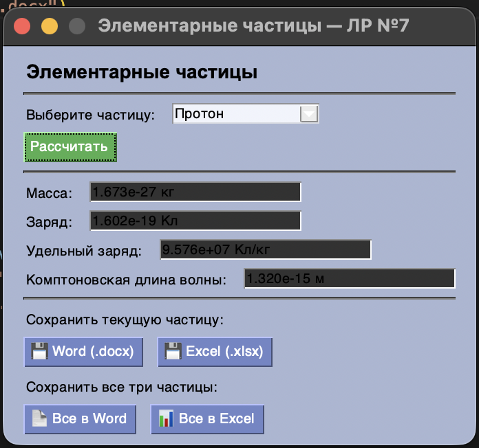

# Lab07

Задание:
Переписать ЛР №6 с использованием классов и объектов. Задание то же (элементарные частицы, расчёт удельного заряда и комптоновской длины волны). GUI-фреймворк — следующий по списку (FreeSimpleGUI). В коде должны присутствовать: абстрактный базовый класс, иерархия наследования, managed-атрибуты, минимум 2 dunder-метода у каждого класса.

---

## Задача 1: Иерархия классов

Условие задачи:
Реализовать абстрактный базовый класс `Particle` и два подкласса — `ChargedParticle` (электрон, протон) и `NeutralParticle` (нейтрон). Каждый класс должен иметь managed-атрибуты и dunder-методы.

Почему я так решил:
Абстрактный класс `Particle` задаёт общий интерфейс — методы, которые обязан реализовать каждый подкласс. Это гарантирует, что нельзя создать «незаконченную» частицу без нужных методов. Разделение на `ChargedParticle` и `NeutralParticle` отражает реальную физику: нейтрон не имеет заряда, поэтому его удельный заряд всегда равен нулю.

Как решил:

* **`Particle(ABC)`** — абстрактный базовый класс. Содержит managed-атрибуты `name` и `mass` с валидацией через `@property`/`@setter`. Объявляет три `@abstractmethod`: `udelny_zaryad()`, `kompton()`, `info()`. Dunder-методы: `__str__`, `__repr__`.

* **`ChargedParticle(Particle)`** — подкласс для заряженных частиц. Добавляет managed-атрибут `charge` с проверкой (заряд > 0). Реализует все абстрактные методы. Dunder-методы: `__str__` (переопределён), `__eq__` (сравнение по массе и заряду).

* **`NeutralParticle(Particle)`** — подкласс для нейтрона. Не имеет заряда, `udelny_zaryad()` всегда возвращает `0.0`. Dunder-методы: `__str__`, `__eq__` (сравнение по массе).

* **`Report`** — отдельный класс для сохранения результатов. Принимает список словарей из метода `info()`. Dunder-методы: `__len__` (количество частиц в отчёте), `__repr__`. Методы: `v_word(path)` и `v_excel(path)`.

---

## Задача 2: GUI на FreeSimpleGUI

Условие задачи:
Реализовать графический интерфейс с использованием следующего по списку GUI-фреймворка.

Почему я так решил:
FreeSimpleGUI — бесплатный форк PySimpleGUI. Его подход «разметка как список строк» очень прост для чтения и объяснения: каждая строка в `layout` — это одна строка в окне. Не нужно вручную размещать виджеты по координатам.

Как решил:

* `layout` — список списков, каждый вложенный список = одна строка окна.
* Главный цикл `while True` читает события (`event`) и значения (`values`) из окна.
* При нажатии «Рассчитать» создаётся объект нужного класса, вызываются его методы, результаты обновляются в полях окна.
* Кнопки сохранения создают объект `Report` и вызывают `v_word()` или `v_excel()`.

---

## Общий вывод

В ходе выполнения лабораторной работы №7 были освоены принципы объектно-ориентированного программирования в Python:

1. **ABC и `@abstractmethod`**: Абстрактный класс задаёт контракт — какие методы обязан реализовать каждый подкласс. Создать объект `Particle` напрямую невозможно.
2. **Наследование**: `ChargedParticle` и `NeutralParticle` наследуют общую логику от `Particle` и добавляют свою специфику.
3. **Managed-атрибуты (`@property`)**: Позволяют добавить проверку при установке значения — например, масса не может быть отрицательной.
4. **Dunder-методы**: Делают объекты «умнее» — `__str__` управляет выводом через `print`, `__eq__` позволяет сравнивать объекты через `==`, `__len__` позволяет использовать `len()`.
5. **FreeSimpleGUI**: Декларативный подход к построению GUI упрощает код по сравнению с Tkinter.

---

## Результат выполнения программы

---

## Ссылки на используемые материалы

1. [ABC в Python — документация](https://docs.python.org/3/library/abc.html)
2. [Dunder-методы — руководство](https://docs.python.org/3/reference/datamodel.html#special-method-names)
3. [Property и managed-атрибуты](https://docs.python.org/3/library/functions.html#property)
4. [FreeSimpleGUI — документация](https://github.com/spyoungtech/FreeSimpleGUI)

---
